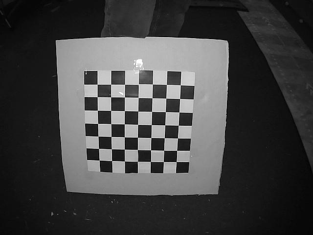

# Webcam based putting simulation with fisheye correction for GSPRO utilizing the R10 connector:

## ALL About Fisheye Lens Correction.

This is a variation of the Alleexx putting simulation (ball_tracking.py) provides a correction for fisheye lens. You can use it just like Alleexx's original putting, simulation without change by simply removing the '[fisheye]' section (and '[camera parameters]' section) in config.ini file.  If you desire to test or see what the fisheye correction does, itis already setup and calibrated to a 3.6mm fisheye lens for an ELP IR USB webcam.  If you want to see it in action using a standard camera, it will provide a distorted view, which is the lens correction being applied to your non-distorting lens.  I've provided a number of addional support utilities in a subdirectory called fisheye. The first program you will want to use is one to help allign the camera. For a fisheye lens, it performs best with the putting line directly on the middle row of the image. So for example if you have a 640wx480h image, you will want to allign you putting path to be on 240h line. The program for this is 'fisheye/simple_cam_allign.py'.  If the bending of your fisheye camera isn't extreme, Alleexx's orginal code should give a good estimate of ball speed and horizontal launch angle (HLA) with just that simple allignment.  If you have a fisheye lens, this will provide an accurate and precise value for HLA and ball speed.  

If you have a fisheye camera and want to build your own lens model, the processes is a little more involved.  The first step is to calibrate the camera and this is done by taking a series of snapshot images of a chessboard in different places in camera's fiield of view.  So first we need to align the camera. I've provided a program to help with this. The program 'fisheye\Snapshot2.py' is used for this purpose. Given a webcam #, and image count, it will take a snapshot and stores a labled image_##.jpg into the folder 'fisheye\Calibrations', it then pause for 5 seconds (so you can move the chessboard) and repeats process for how ever many images you've specified.    

Here is a detailed video that explains all of the math behind the fisheye lens correction. https://www.youtube.com/watch?v=-9He7Nu3u8s

Once you have your set of calibration images; we need to run a program that creats a model of the lens distortion.  The program that performs that task is 'fisheye\calibration_fisheye2.py'. This  calibration program which looks for a chessboard image reads it from multiple locations to create a lens distortion model.  It creates 3 arrays which are stored in the .\config.ini under a section called '[fisheye]' and writes three arrays K, D, and scaled_K in that section.  You can test the calibration arrays by running the 'fisheye\undistort_simple_cam.py' which reads the K,D and scaled_K lens model from the config.ini and applies it to a live camera view.  It should straighten out any lines or edges that are bowed from the fisheye lens.  If you are statisfied with the calibration then you can try the .\ball_tracking program.

.\ball_tracking.py will read the '[fisheye]' K, D, and scaled_K paramters in the .\config.ini file and apply use them to apply corrections to the X,Y coordinates of the ball tracking points. 
It will use the modified points to then calculate ball_speed and HLA. The routines that undistort the points is only applied if it sees the K array under the '[fisheye]' section. 

&nbsp&nbsp&nbsp&nbsp&nbsp&nbsp

The fisheye camera correction routines are a little more complicated to setup that Alleexx's original code and it has a number of new options.  One problem I've had, is I'm using an ELP nighttime IR camera.  Unlike, a typical webcam used in Alleexx's code, the IR cam can use any color golfball.  I like the IR camera also because it can work in almost all lighting.  The balls all look like a white ball in color in IR.  However, it does require tweeking some advanced camera parameters like the exposure, hue, gamma, and gain for the camera to lock in to the ball. To help with IR camera, I've added routines that allow you to record all of the camera parameters like exposure, the auto_exposure switch, hue, staturation, brightness, whitebalance, gamma, gain etc. These can also be writen into the .\config.ini file under the section '[camera parameters]'. By pressing 'v' it will bring up the camera control dialog that allows you to change and tweek these values live. Once set you press 'w' and it will write the values into a the '[camera parameters]' section.  When the program is run again, it will read and setup the '[camera parameters]'.  It's also optional.  Another option is to let you see the undistorted view that's being used by the fisheye correction.  Pressing 'u' will toggle between the undistorted view and the normal view of the live video stream.  
  
As a test, this program has already been calibrated using an IR camera with a 3.6mm fisheye lens (~90 degree field of view).  To return it to alleexx's original code, simply remove the '[fisheye]' and '[camera parameter]' sections in the .\config.ini.  For convience, I've include executable binaries of the python code for all of the programs mentioned under the \dist\ball_tracking\ folder.  
To run the new ball_tracking you would run it like; 'cd dist\ball_tracking' the run 'ball_tracking.exe' and it will use the .\config.ini for configuration.  It also contains the Calibrations\ and db\ folders for you calibration images.  

This version introduces a Perspective_pitch correction (perspective_pitch2.py) which will perform a perspective pitch of the image around the center horizontal line (which should be your putting line).
The angle represents the camera angle looking down on your putt line, and will apply a perspective warp to the image based on that angle.  This should help anyone who has there camera mounted at an angle looking down to your putting surface.   This correction gets applied after the fisheye, and since the fisheye correction is optional it should work properly for standard webcams. This will adjust refine any off line putts mainly on the HLA, but also speed of offline putts.  With this adjustment, it should be possible to putt off of center to correct for some green slopes in game.  So it should add a new dimension to Sim putting.

&nbsp&nbsp&nbsp&nbsp&nbsp&nbsp

 
When the putting line is aligned with center row of the image we can calculate an image from the view of a camera pitched around that line. Kowning that angle, we can apply some simple trigonmetry to find the view apply a perspective transform.   This can allow us to reverse the perspective distotion by simply knowing the camera pitch angle. This all depends on your putting line matching the line the image will be pitched around.  To help establish the angle of your camera looking down at the putting line, use the program called Perspective_pitch.py.   Basicall the slider goes from 0 to 90 degrees (starting at 0), causing the live image to pirtch around the putting line.  To make this easier, you may want to put a pair of rulers in the screen or other objects so you can tell when the image is alligned flat. In my case, I have to aiming sticks a couple of golf balls and some checkerboards patterns rotated around the pitch axis and transformed to an appearance as if the camera was overhead looking directly down.  
</p?

 

This angle is written out to the config.ini file under the lable 'perspective'. It's then read back in the ball-tracking.py program and used to apply corrections to the HLA and ballspeed measurements.

Greens are measure using a Stimpmeter, which is a 36in alumimum v-shape rail held at a 22 degree angle, and you roll a golfball down the rail from the 30in mark.   At the bottom of the rail, the ballspeed is assumed to be exactly 95.5 inch/sec or 5.426136 MPH.  It will travel across the green an decellerate to 0m.  A travel distance of 10ft = Stimp 10,  11ft = Stimp 11, and so on.  Stimp 7 is considered slow, 13-14 is fast.  So for a stimp rating of 12, what would the initial ballspeed be for a putt that travels 20ft and comes to a stop. It would be 1.118182 MPH. So you get an idea of just how slow the ball has to launch for a 20ft putt.  For my system, the anything slower than 4mph is nearly impossible to create, so I've added a new 's' key option that will bring up a slide bar to allow you to select stimp.  Basically is slows down the the putt speed by a certain percentage.  My typical 20ft putt on a stimp 12 would feel like a tap and move a foot. But on screen it would move 20ft.  So simply devide the ball speed by a factor and it may help with the feel of the putt and provide more realism.  "http://www.waddengolfacademy.com/putting/USGA%20Green%20Speed%20Physics.pdf"

 
The end result is the correct calculation of BallSpeed in MPH and HLA of the putt. Initial insperation on the solution comes from natter where I forked the initial OpenCV code.

These connectors integrate the putting app to use in GSPRO

- extension of original R10 connector of Travis Lang https://github.com/alleexx/gspro-garmin-connect-v2
- matth version of R10 adapter with direct bluetooth support https://github.com/mholow/gsp-r10-adapter

## Setup:

You can find a setup video here: https://youtu.be/ShtEW0fziwM

You can download the release or just install the packages and run the app via python.

Unpack the release zip and run ball_tracking.exe [-c <ballcolor OR calibrate> -w <webcamera number 0-5>]

- Position Webcam on the side and above the putting start area across from you - see video for example (flip image in "a" Advanced Settings to allow for left handed setups)
- Position the Ball (choose the right color or use calibrate as described below.) on a dark green surface - In my test the area visible to the webcam was about 1 meter high and across from me
- Adjust your webcam to the white line to reflect a straight putt and place your ball into the yellow rectangle.
- Use "a" to go to Advanced Settings - here you can adjust following settings
  - adjust camera settings by using the DirectShow camera settings window (only supported if MJPEG is enabled = 1 - dafault)
  - the start position rectangle
  - set a fixed radius if the detected radius is not consistent for you
  - flip webcam image if i.e. your a lefty
  - enable MJPEG option for changing the webcam codec to compressed MJPEG format - some webcams only support higher like 60 FPS settings on compressed video formats - auto detection of FPS settings will not work for this codec but acutal FPS should be accurate. In case the desired FPS is only available in certain resolution you can adjust/overwrite the resolution directly in the config.ini file
  - overwrite the detected FPS with a target FPS setting if not detected correctly - not all cameras support setting FPS through OpenCV
  - darken the images in case your webcam settings do not allow for this
  - beta option of ps4 enabling is done in config.ini directly
  - Use the new 'v' option to adjust camera parameters (pressing 'a' will bring this panel up too).
  - Use the new 'w' to write out the camera parameters to the config.ini
  - Use the new 'u' to toggle between the undistorted corrected video stream and the normal video stream. 
- Once identified the ball should get a red circle fully around. If it is smaller or bigger than the ball it will not reflect the right putting speed. It must match the ball dimensions as best as it can.
- If the ball is not detected try adjusting the light situation or your webcam brightness settings or try a different ball color option (hit q to exit the putting simulator and start again with another Ball Color)
- The putt needs to cross the red rectangle and needs to leave on the other side
- If a shot is detected it is send to http://localhost:8888/ where my extension of the garmin connect app (https://github.com/alleexx/gspro-garmin-connect-v2) is receiving the shot and passing it to GSPRO
  
## Some Troubleshooting steps if you can not get it to work

I guess you saw my setup video so here are some more details.

- Make sure to have a solid background. Green putting or hitting mat should be fine - The darker the better.
- Don't cast a direct shadow over the ball if possible have some light on the ball side
- Use a colored ball - orange works best for most people with color option orange2
- Use the advanced settings (hit a) to limit the detection area a bit around the ball placed
- Usage of MJPEG/DirectShow gives also now access to camera properties like saturation/exposure like you have it in kinovea - the window will open alongside if you hit "a" for advanced settings. This should help to find a good camera setting for ball detection. Adjusting the saturation, exposure and white level is helping to get a good reading. As all webcams are different this can not be done automatically and you have to do so manually to get a good result. Try to get a good red circle around the ball and try to eliminate the false detections/radius reading in other parts of the view. 
- Use the advanced settings darkness setting to limit the light reflections in the frame. Hopefully the ball will be detected in this way.
- If this does not help you can hit "d" and see the advanced debug options. It will show you the mask frame and let you see if you have any other "white" = detected spots in the area. It is also possible to directly there change the color seperation options which you could try but hopefully would not be necessary. Some people had to alter saturation and exposure in their webcam settings to get a good base image of the webcam where the colored ball really shows good.
  
Software is open source. Feel Free to buy me a coffee or a sleeve of golf balls if you like it.

Here is a short video demonstration of the prototype

https://youtu.be/ZgcH25WkCWQ

  
## Details on the python app

You can install the necessary packages by running pip install with the requirements file - some mentioned packages might not be necessary to run it as I did not clean it up yet

Install the app:

"pip install -r requirements.txt"

Run the app:

"python ball_tracking.py"

Default color to be found is yellow - You can adapt this by running -c as color options yellow, green, orange, red or white. White is a very general option if no color ball is availabe but might give you more false reads on other white objects. Best options for me are orange, yellow and red.

"python ball_tracking.py -c orange"

In the app you can hit "a" for advanced settings to define the ball detection area, flip and darken image or hit "d" to get a debug view of the video feed to see the color detection mask.

There are also other options to for start to pass a video file or image file

usage: ball_tracking.py [-h] [-v VIDEO] [-i IMG] [-b BUFFER] [-w CAMERA] [-c BALLCOLOR] [-d DEBUG]

options:

  -h, --help                  show this help message and exit

  -v VIDEO, --video VIDEO     path to the (optional) video file

  -i IMG, --img IMG           path to the (optional) image file

  -b BUFFER, --buffer BUFFER  max buffer size - default is 64

  -w CAMERA, --camera CAMERA  webcam index number - default is 0

  -c BALLCOLOR, --ballcolor   ball color - default is white

  -d DEBUG, --debug DEBUG     debug - color finder and wait timer

